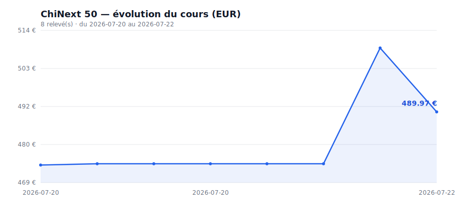

# Suivi du cours de l'indice ChiNext 50

Ce dépôt relève automatiquement, une fois par jour, le cours de l'indice
**ChiNext 50** (创业板50, Bourse de Shenzhen, code `399673`) et l'enregistre dans
`prix.csv`, **en CNY (yuan) et en EUR** (conversion au taux du jour).

## Évolution du cours



*(Graphique régénéré automatiquement à chaque relevé.)*

## Comment ça marche

- `recuperer-prix.mjs` : interroge l'API de Yahoo Finance (indice + taux CNY→EUR),
  calcule le prix en euros, ajoute une ligne au CSV, et calcule la variation sur
  7 jours glissants (pour l'alerte).
- `generer-graphique.mjs` : régénère `graphique.svg` à partir du CSV.
- `.github/workflows/suivi-prix.yml` : lance tout ça chaque jour à 08:00 UTC
  (et permet un lancement manuel depuis l'onglet **Actions**).
- `prix.csv` : le fichier de résultats, mis à jour automatiquement.

## Colonnes du CSV

| Colonne         | Signification                              |
|-----------------|--------------------------------------------|
| `date_utc`      | Date et heure du relevé (en UTC)           |
| `indice`        | Nom de l'indice (ChiNext50)                |
| `prix_cny`      | Cours en yuan chinois (CNY)                |
| `taux_cny_eur`  | Taux de change utilisé (1 CNY = ? EUR)     |
| `prix_eur`      | Cours converti en euros (CNY × taux)       |

## Alerte email (variation > 5 % sur 7 jours)

Si le cours (en CNY) monte ou baisse de plus de **5 %** sur une **semaine
glissante**, un email d'alerte est envoyé. Cela nécessite 3 *secrets* dans le dépôt
(**Settings → Secrets and variables → Actions**) :

| Secret          | Valeur                                             |
|-----------------|----------------------------------------------------|
| `MAIL_USERNAME` | Adresse Gmail d'envoi                              |
| `MAIL_PASSWORD` | « Mot de passe d'application » Gmail (16 caractères)|
| `MAIL_TO`       | Adresse qui reçoit l'alerte                        |

Pour **tester** l'envoi sans attendre : onglet **Actions** → *Suivi prix ChiNext 50*
→ **Run workflow** → coche « Envoyer un email de test ».

## Tester à la main

```bash
node recuperer-prix.mjs
node generer-graphique.mjs
```
